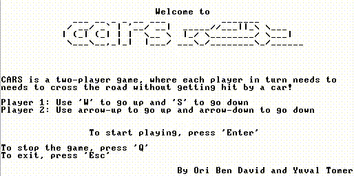

# Nand-to-Tetris-Project

This repository contains my solutions and implementations for the "Nand to Tetris: Building a Modern Computer from First Principles" course. 
Through this course, I've built a complete computer system from the ground up, starting with basic logic gates and progressing all the way to high-level programming.

## The "Cars" Game

One of the highlights of this project is the creation of the "Cars" game, which we developed to run on the computer system we built. This game showcases the power and versatility of the computer we constructed from first principles.

